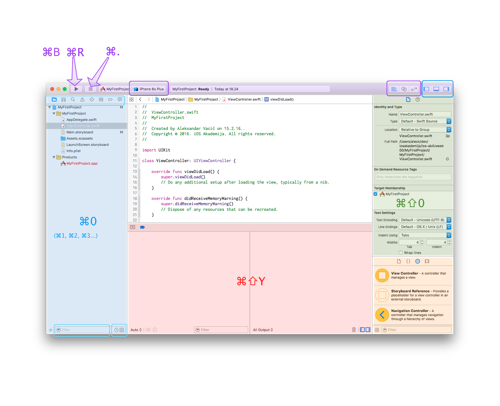

iOS Akademija

# Predavanje / 00

---

U narednih 3 meseca naučićete…

* Osnovne koncepte u programiranju
* Swift 3 programski jezik - osnovni do srednji nivo
* iOS 10 SDK[^Software Development Kit] - najčešće korišćene API[^Application Programming Interface]

* macOS Sierra - korišćenje i osnovno snalaženje u okruženju
* Xcode 8 - razvojni alat
* git i uopšte značaj _Source Code Version Control_

* Dnevno-programerski život

Danas počinjete.

<iframe width="560" height="315" src="https://www.youtube.com/embed/cJAGqDYmW1o" frameborder="0" allowfullscreen></iframe>

A ako želite postati i ostati dobar developer - nikada nećete prestati da učite.

---

## iOS development

Ima mnogo faza u razvoju u razvoju jedne aplikacije, ali se ugrubo može podeliti na ove 3:

0. Specifications & Requirements
1. [Design](https://developer.apple.com/design/)
2. [Development](https://developer.apple.com/develop/)
3. [Distribution / Publishing](https://developer.apple.com/distribute/)
4. Support & Maintenance 

### Resursi

(1) [App Development with Swift](https://itunes.apple.com/us/book/app-development-with-swift/id1118575552?mt=11) na iBooks Store
* Ova knjiga je tek izašla i deo je Appleove [Everyone Can Code](https://www.apple.com/education/everyone-can-code/) inicijative

(2) [Start Developing iOS apps](https://developer.apple.com/library/content/referencelibrary/GettingStarted/DevelopiOSAppsSwift/)

(3) [Hacking with Swift](https://www.hackingwithswift.com/read)
* Fantastičan set nekoliko desetina besplatnih tutorijala
* Autor ima i čitav niz drugih korisnih knjiga i materijala

itd.

---

## Swift

* Swift je Appleovo čedo i ažurni pregled bitnih stvari uvek imate na [Apple Developer](https://developer.apple.com/swift/) portalu
* Svetlo dana je ugledao 2014-e, na [opšte iznenađenje](https://youtu.be/MO7Ta0DvEWA?t=28) i [oduševljenje](https://youtu.be/MO7Ta0DvEWA?t=112) developera u Apple ekosistemu.

* [Swift](https://swift.org/) je prošle godine postao open-source i razvija se pod lupom javnosti i uz učešće bilo koga ko ima vremena, znanja i želje.
* Sam Swift 3.0 je [rezultat takvog rada](https://swift.org/blog/swift-3-0-released/) u prethodnih godinu dana.
* [Istorija promena](https://github.com/apple/swift/blob/master/CHANGELOG.md) jezika je [na GitHubu](https://github.com/apple/swift/) kao i kompletan razvojni put

**Swift 3 Programming Language** je udžbenik, dostupan u više verzija:

* [web stranica](https://developer.apple.com/library/content/documentation/Swift/Conceptual/Swift_Programming_Language/)
* [iBooks knjiga](https://itunes.apple.com/us/book/the-swift-programming-language/id881256329)
* [ePub](https://swift.org/documentation/TheSwiftProgrammingLanguage(Swift3).epub)

### Resursi

* [Gomila stvari](https://developer.apple.com/swift/resources/) na Developer portalu
* [Swift Playgrounds](https://developer.apple.com/swift/playgrounds/) za iPad
* Appleov [Swift blog](https://developer.apple.com/swift/blog/)

*Plus* mali milion drugih knjiga, blogova, primera koda itd.

### Šta sa ovim znanjem možete raditi

Možete kreirate: macOS, iOS, tvOS, watchOS aplikacije.
Za App Store. 
Za ličnu upotrebu i društvo. 
Za klijentske poslove. 
Za velike firme, [kaže IBM](http://www.computerworld.com/article/3122994/apple-mac/ibm-says-swift-is-now-ready-for-the-enterprise.html).

Može i za web aplikacije (ako ste hrabriji).
Moguće uskoro i za Windows aplikacije.

---

## Xcode 8

[Xcode](https://developer.apple.com/xcode/) 8 je najnovija verzija razvojnog okruženja. Besplatan je, razvijan od strane Applea i kompletan Apple koristi ovo razvojno okruženje za njihov interni razvoj. Sastoji se od mnoštva manjih komponenti i takav alat se zove IDE[^IDE=Integrated Development Environment].

Sem samog editora za kreiranje koda, verovatno najbitniji deo je [Interface Builder](https://developer.apple.com/xcode/interface-builder/) za kreiranje UI-a[^UI=User Interface].

[Dodatni alati](https://developer.apple.com/xcode/features/) koji su vam automatski dostupni su razni iOS Simulatori kao i specijalni alat za merenje performansi po imenu Instruments.



* Toolbar na vrhu
	- build / run. (click+hold za dodatne opcije)
	- izbor gde se instalira app, na koji uređaj / simulator
	- tekuće informacije u sredini
	- Panel toggles krajnje desno
	- Editor type Switcher: Standard, Assistant, Version

* Navigators levo
	- filters dole na dnu

* Editor u sredini

* Utilities desno
	- Paneli na vrhu, Menjaju se zavisno od konteksta
	- Libraries na dnu

* Debug / Console dole
	- Watch window
	- Console

---

## Šta znači biti programer

Developer / Swift developer / iOS app developer / šta su razlike između ovih “titula”?

* Ken Mazaika : [Šta bih voleo da sam znao kada sam počeo](https://www.quora.com/What-are-some-things-you-wish-you-knew-when-you-started-programming/answer/Ken-Mazaika?srid=vWBY)

* Marcin Krzyżanowski : [Kako biti fenomenalan Swift developer](http://blog.krzyzanowskim.com/2015/12/28/how-to-be-awesome-swift-developer/)

Biti programer nije baš isto kao što se predstavlja u serijama. Ako gledate “Halt and Catch Fire” ili “Silicon Valley” deo koji vidite je onaj zanimljiv, obično na početku ili kraju razvojnog ciklusa. One sate provedene u čitanju dokumentacije vam nikada neće prikazati jer ko će to zaboga gledati. :)

Ali kada jednom pročitate sve to i skapirate kako stvari rade, onda možete napraviti neke prilično **cool** stvari.

<iframe width="560" height="315" src="https://www.youtube.com/embed/-1Y2WfcCb4M?t=19" frameborder="0" allowfullscreen></iframe>

---

Programiranje je takođe i oblast u kojoj se znanje deli naširoko i nadugačko i besplatno, putem sajtova kao što su [Stack Overflow](http://stackoverflow.com), [GitHub](https://github.com) itd. To je svet konferencija i [ad-hoc grupa](http://cocoaheads.tv) čija predavanja su gotovo uvek besplatno dostupna kroz [YouTube](https://www.youtube.com/results?search_query=ios+conference), [Vimeo](https://vimeo.com/search?q=ios), [Realm News](https://realm.io/news/) ili [PoMo](http://www.pomo.tv) sajtu. Itd.

Takva nesebičnost i spremnost da se pomogne nije nešto što ćete naći u mnogo oblasti ljudskog delovanja.

A onda, nakon dosta znanja i truda i godina provedenih u Xcode-u ili nekom sličnom alatu, napisaćete kod koji će biti toliko savršen da mu se više ništa ne može oduzeti niti dodati. To je programerska nirvana.

> [Beautiful Code](http://nvie.com/posts/beautiful-code/) is poetry.

---

## Lagani uvod u programiranje…

**Vreme** je primarna dimenzija sa kojom baratate u programiranju.
Svaka komanda, instrukcija koju napišete zahteva određeno vreme da se izvrši. Najčešće nemate pojma koliko je to vreme, niti u suštini treba da se bavite time preterano (ima izuzetaka, naravno). Ono čime se bavite su pojedini značajni momenti: kada neka akcija / celina / šta god *počinje*, kada se završava itd.

Najveći deo koda koji pišete se izvršava tačno onim redom koji se napisali. Naredna komanda / funkcija / itd… - počinje odmah nakon što se završi prethodna. Kaže se da se izvršava sekvencijalno, odnosno sinhrono.

Međutim, stvari nisu baš tako crno/bele. Na primer ovakav neki kod:

```
loadingIndicator.startAnimating()
downloadPhoto()
displayPhoto()
loadingIndicator.stopAnimating()
```

Q1: Koliko dugo će se *loading indicator* vrteti, ako prenos slike traje 3s a procesiranje i priprema za prikaz pola sekunde?
A: ..?

Kod će se izvršavati jedan po jedan red. Tako da bi prvi odgovor mogao biti 3.5s. Međutim nije tako i odgovor je (za iOS): neće se zavrteti uopšte.

Razlog je druga bitna dimenzija programiranja: **raspoloživost i upravljanje datim resursima**. Ta animacija, to što se vrti - nešto u računaru treba i time da se bavi *paralelno* sa prenosom i obradom slike. Što znači da - već u ovako trivijalnom primeru - da pišete *asynchronous code* - kod koji se račva i izvršava u dva (ili više) paralelna niza **+** da ih onda usaglasite pa da se opet spoje i da se animacija zaustavi tačno u momentu kada se slika prikazuje.
Takav način izvršavanja se u programiranju realizuje konceptom niti, tj. *threads*.

Bavićemo se time dosta, za sada samo napomena da se u iOS-u sve što vidite na ekranu izvršava u jednom jedinom _threadu_ koji se zove `main thread`. Sve unutar njega je _sync_, tako da ako se main thread bavi animacijom, onda ne može da se bavi i prenosom. Ako počne da se bavi prenosom slike, mora da batali animaciju. Zato je 0 trajanje, tj. nikada zaista ni ne počne.

Treći koncept koji je ekstremno bitan jeste opseg važenja, odnosno **scope**. To je mnogo lakše objasniti kada krenemo da zaista učimo Swift, pa se neću zadržavati na tome.

Četvrti - i poslednji za danas - bitan domen programiranja je imenovanje. **Naming** is hard. Kada pišete programe, vi non-stop nečemu dajete ime, referencirate se na ta imena. To je jedan od najtežih problema u programiranju; nije šala.

Jedna od čuvenijih izreka / viceva:

> There are two hard things in computer science:   
cache invalidation and
naming things

A postoji i varijacija koja je - po meni - dosta bliža realnosti:

> There are only two hard things in computer science:   
*cache invalidation* and
*naming things* and
off-by-one errors.

---

I to je prvi domaći koji imate: 

* protrčite kroz Swift [API Design Guidelines](https://swift.org/documentation/api-design-guidelines/)
* pogledajte istoimeno predavanje, [sesija (403) sa WWDC-a 2016](https://developer.apple.com/videos/play/wwdc2016/403/)

Mnogo toga vam neće biti jasno, ali tako je uvek na početku.