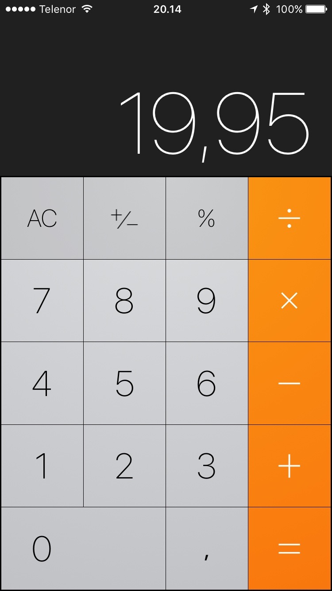
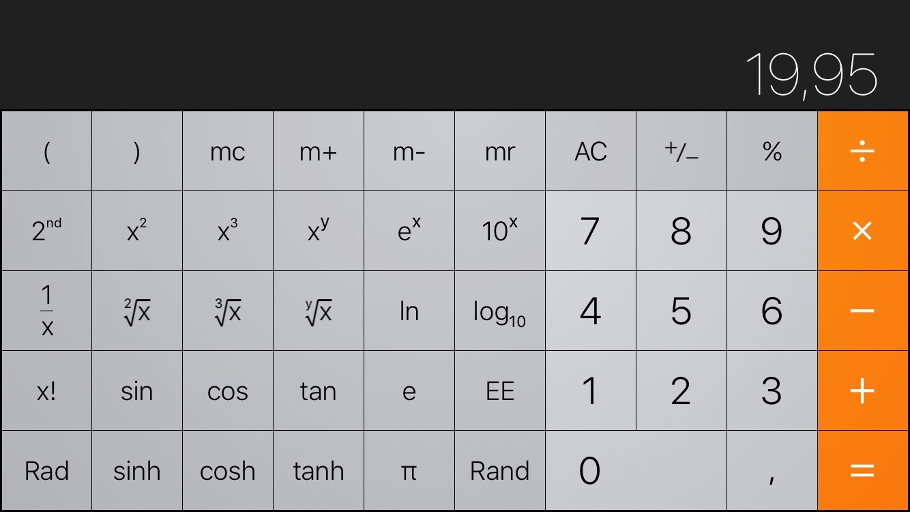
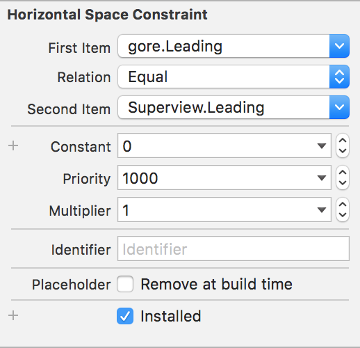

iOS Akademija

# Predavanja / 01

Kreeeeeećemo!

U paraleli učimo:
* osnovne programske koncepte
* Swift 3
* Kreiranje UI za iOS app


## Swift Playgrounds

[Apple Help/opis](https://developer.apple.com/library/prerelease/ios/recipes/Playground_Help/_index.html) za Playgrounds

* [Šta su Swift Playgrounds](https://medium.com/swift-programming/swift-playgrounds-interactive-awesomeness-2a74143c233), blog post Keitha Elliotta
* [Predstavljanje Playgrounds](https://developer.apple.com/swift/blog/?id=35) na Swift blogu
* [Introducing Swift Playgrounds](https://developer.apple.com/videos/play/wwdc2016/408/), sesija 408 sa WWDC 2016


## Swift osnove

* Promenljive (variables) i konstante (constants)

```
var channel = 20
var newChannel: Int = 30

let swiftBirthYear = 2014
```

Bilo koji znak – uključujući i 😀☺️😇🐶🐮 – može biti u imenu promenljive, konstante itd.

<blockquote class="twitter-tweet" data-lang="en"><p lang="en" dir="ltr">Word of Lattner. <a href="https://t.co/VmaYzDiNAR">pic.twitter.com/VmaYzDiNAR</a></p>&mdash; ericasadun (@ericasadun) <a href="https://twitter.com/ericasadun/status/677647501990764546">December 18, 2015</a></blockquote> <script async src="//platform.twitter.com/widgets.js" charset="utf-8"></script>

Komentarisanje koda (comments) se radi na dva načina:

```
// ovo je jedno-linijski komentar

/*
	Ovo je više linijski komentar
*/
```

### Tipovi podataka (Data Types)

Prosti tipovi
* Numerički: `Int`, `UInt`, `Float`, `Double`, `Bool` itd.
* Tekstualni: `String`, `Character` itd.

String je prilično moćan tip podataka koja ima tuštma i tma mogućnosti korišćenja. U Swift 3 udžbeniku imate dosta stranica o tome ali ćemo ih za sada preskočiti i vratiti se na to dalje u  kursu kroz praktične primere.

* Numerički operatori: `+`, `-`, `*`, `/` i `%` (ostatak deljenja)
* Dodeljivanje vrednosti: `=`
* Compound operatori: `+=`, `-=`, `*=`, `/=`, `%=`

* Unary `minus` operator se primenjuje za brojeve (Int, Double i ekipa): `-` 
Primer:
```
var x = 20
var y = -x		//	y je sada -20
```

* Comparison operators: `<`, `<=`, `>`, `>=`, `==` (jednakost), `!=` (različitost)

* Logical operators: `&&` (AND), `||` (OR)
Primenjuju se isključivo nad logičkim (`Bool`) promenljivama ili vrednostima
* Negacija spada u logičke operatore i primenjuje se isključivo nad `Bool` vrednostima ili promenljivama:
```
var bx = true
var by = !bx		//	y je sada false
```

* Ternary operator:
```
var bx = true
var by = false
var bz = true
var brez = (bx) ? by : bz
```

Ovo se tumači na sledeći način:
- ako je `bx` jednako `true`, onda će vrednost `by` biti dodeljena `brez`
- ako je `bx` jednako `false`, onda će vrednost `bz` biti dodeljena `brez`

## Definicija sopstvenih tipova

```
typealias AudioChannel = Int
var zvuk: AudioChannel = 0
```

Ovo je najtrivijalnija definicija sopstvenih tipova podataka. 

Ima još mnogo načina koje ćemo proći kroz kurs a spomenuo sam ih već sada jer prilikom pisanja aplikacija **vi baratate gotovo isključivo sa tipovima podataka koje sami definišete** (u većoj ili manjoj meri).

### Tuples

Kompleksniji tip podatka koji se sastoji od dva ili više osnovnih tipova:

```
let http404 = (404, "File Not Found")
typealias HTTPStatus = (code : Int, message : String)
```

## Collection Types

Kolekcije su prve kompleksnije strukture podataka koje Swift pruža:

* niz, tj. `Array`
* set, tj. `Set`
* rečnik, tj. `Dictionary`


Primer niza:

```
let ekipa = ["Boris", "Ivan", "Vlada", "Alek"]
// puna deklaracija
let crew: [String] = ["Boris", "Ivan", "Vlada", "Alek"]
```

Primer rečnika:

```
let responseStatuses = [404: "File not found", 403: "Permission denied"]
// puna deklaracija
let httpStatuses: [Int: String]
```


# iOS dev

Osnovni vodič za dizajn iOS aplikacija jeste [iOS Human Interface Guidelines](https://developer.apple.com/ios/human-interface-guidelines/). *Obavezno* pročitati barem jednom u narednih mesec dana, pogotovo ako niste koristili iOS do sada.

## Koncepti: Views, Subviews, Controls 🤔

1. `UIScreen` = reprezentacija fizičkog uređaja.
2. `UIView` = osnova svega u iOS-u
3. `UIWindow` = podvrsta UIView, koji stoji na vrhu svega, odmah ispod UIScreen.
4. `UIControl` = podvrsta UIView-a sa dodatnim parametrima i mogućnostima
5. `UIButton`, `UITextField`, `UISwitch` itd - sve su to podvrste `UIControl` 
itd.

Kako da posmatrate ove stvari: brojeve i stringove znate iz realnog života. Imaju svoju namenu i intuitivno znamo čemu služe i imaju istu namenu u programiranju.

Sve ove `UI*` stvari - nisu ništa drugo nego tipovi podataka, smišljeni i kreirani kao reprezentacija “vrednosti” odnosno objekata koji su neophodni za kreiranje programskih interfejsa.

View je apstraktni objekat koji na najosnovnijem nivou predstavlja 2D pravougaonik u kome se nešto iscrtava. Recimo list papira. 

Kontrola se zasniva na viewu jer joj je potreban deo tog papira da bude iscrtana. Ali pritom ima i dodatne mogućnosti, da recimo reaguje na dodir. `UISwitch` je kontrola koja bukvalno predstavlja prekidač i te spomenute dodatne mogućnosti kod Switcha su da može da pruži informaciju o trenutnom stanu - da li je on/off - i da dojavi kada se to stanje promeni.

(Videti Xcode Debug View prikaz)


## Project

Jednu app čini mnogo različitih fajlova. _Project_ je container za sve te fajlove.

* File → New project 
* Single View
* Ime projekta - preporuka da bude bez razmaka, jer Xcode to iskoristi za ime foldera
* Organization = ime kompanije / lično ime
* Organization Identifier = vrlo bitno.
Preporuka: reverzni DNS web sajta
	= Bundle identifier na App Storeu
* Obavezno selektovati: Create git repository on `My Mac`

`.xcodeproj` ekstenzija je zapravo folder sa specijalnim imenom koji krije razne informacije koje su Xcodeu neophodne da zapamti opšta setovanja projekta, koji fajl ste poslednji menjali pa da ga odmah na početku prikaže itd.

### Storyboards, Xibs

Šta se krije iza `.storyboard` ekstenzije?
XML format koji opisuje scene i kontrole koje čine UI.

Kako videti taj XML format:

- klik na Main.storyboard
- klik na Version Editor
- klik na Standard Editor


## Naša prva app: Calculator

Rekreiraćemo UI Appleove Calculator app, iz iOS 10:




### Projekat, podešavanja

* PROJECT, podesiti iOS deployment target. 
Gađati najviše jednu _major_ iOS verziju pre aktuelne *ili* aktuelnu verziju

### Kako iOS zna gde je početak aplikacije?

- klik na Project, 
- klik na Target
- General tab
	"Main Interface"
- Main.storyboard → View Controller → Attributes Inspector
- Is Initial View Controller = ON


## Interface Builder

Komponenta Xcode-a u kojoj se crta interfejs (UI) aplikacije.
Od raznih tehnologija koje se koriste za kreiranje interfejsa, najbitnija je…

### Auto Layout

Auto Layout u praksi znači da vi kreirate set pravila koja definišu međusobni odnos kontrola i viewova na ekranu, što se putem koda prevodi u sistem jednačina koje Auto Layout engine rešava i računa tačne veličine i pozicije za svaki view/kontrolu.

Svako takvo pravilo se zove *constraint* i osnovni format je:

```
Item1.attribute = Item2.attribute * multiplier + constant
```

U Xcodeu to izgleda ovako:



Sem ovih parametara constrainta, još par stvari je bitno, pogotovo kada se stvari zakomplikuju pa ima mnogo “jednačina” koje AL engine treba da reši:

* Constraint priority
* Implicit, odnosno [Intrinsic Content Size](https://cocoacasts.com/what-is-intrinsic-content-size/)
* [Content Hugging](https://littlebitesofcocoa.com/69-compression-resistance-content-hugging)
* [Compression Resistance](https://littlebitesofcocoa.com/69-compression-resistance-content-hugging)

Q: Šta je minimalni set potrebnih constrainta da bi layout bio validan, odnosno potpuno definisan?

* U načelu, za svaki view morate imati minimum 2 constrainta po  svakoj od dimenzija: horizontalno i vertikalno 
* Kombinacije mogu biti različite: 
	- horizontalni početak (udaljenost od _leading_ ivice superviewa) + širina
	- udaljenost od _leading_ ivice superviewa + udaljenost od _trailing_ ivice superviewa
itd.


### Zašto je Auto Layout potreban?

* sve više rastuća količina [različitih iPhone i iPad rezolucija](http://www.paintcodeapp.com/news/ultimate-guide-to-iphone-resolutions)
* A tu su i ᴡᴀᴛᴄʜ i tv :)

* [iosres.com](http://iosres.com)

(Pogledajte i fajl [resursi.html](../resursi.html) u predavanja git repou, za dodatne korisne linkove)
