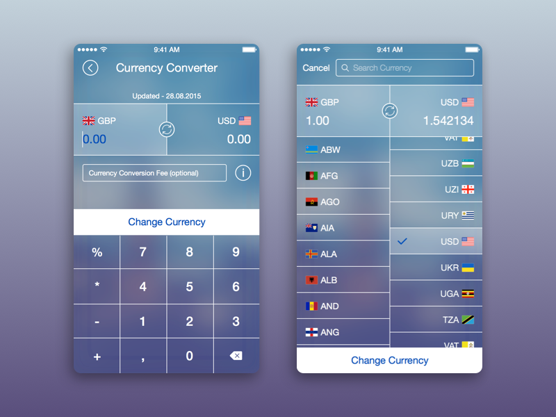
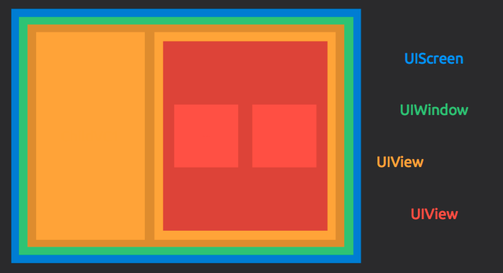
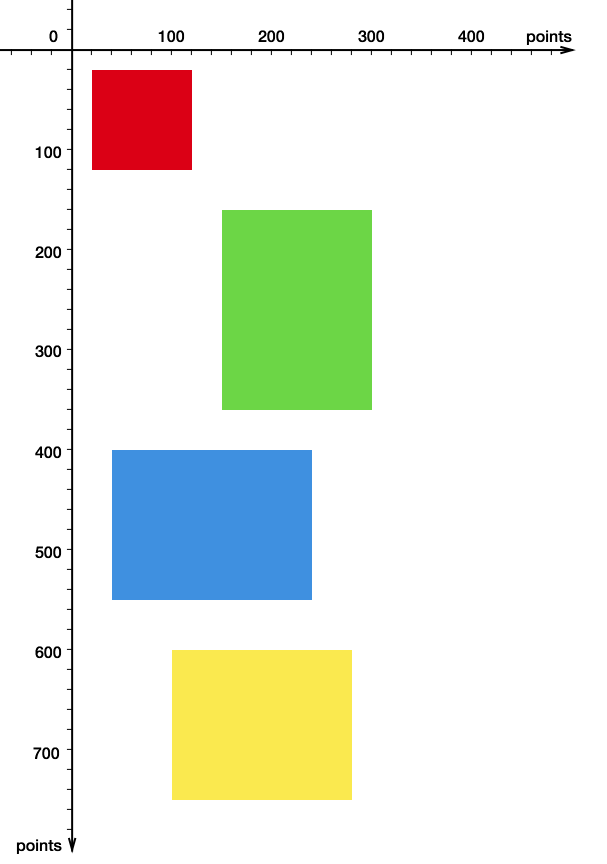
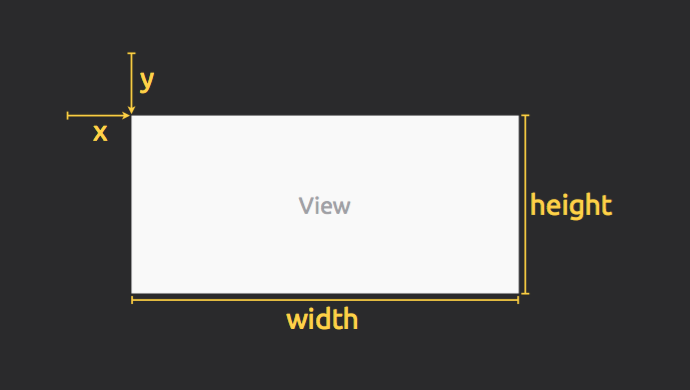
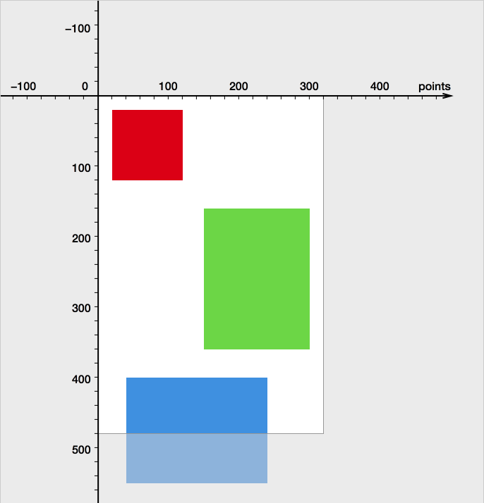
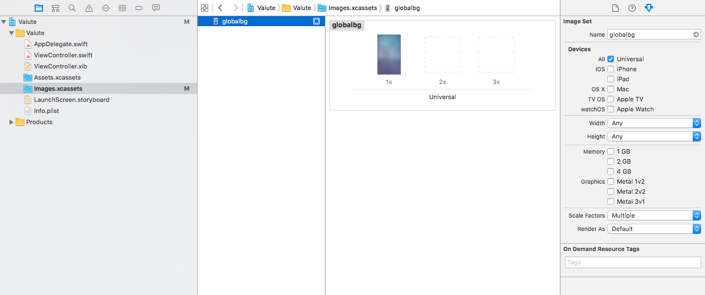

iOS Akademija

# Predavanja / 05


---

# Potpuno nova app: Valute

> Krećemo u novi projekat: kreiramo *konvertor valuta*. 

Bitni koraci kada se kreira nova app:

Korak pre svih koraka: *Šta treba da radi? Ima li smisla? Ima li tržišta? Šta već postoji?* Itd. == Market Research

Za vežbanje i učenje, sve to možemo da preskočimo. 🤗 Smatramo da imamo ideju, cilj, šta treba da se uradi.

Ok, onda sada ide lista:

1. Ime
2. Ikona
3. Grubi spisak funkcionalnosti
4. Analiza potrebnih resursa
5. Analiza potrebnih ekrana za postizanje željene funkcionalnosti
6. Dizajn
7. Opet analiza potrebnih resursa, na osnovu dizajna (ikone unutar app, grafički resursi itd)

> Ne zaboravite na [iOS HIG](https://developer.apple.com/ios/human-interface-guidelines/) (Human Interface Guidelines)

> [Distribute on App Store](https://developer.apple.com/app-store/) deo na Apple Developer portalu

### Ime

Naš konvertor će se zvati: Valute

### App Icon

* Simpa izvedba [novčića](https://dribbble.com/shots/1239917-Social-Coins)
* Nepostojeća valuta - [redizajn US dolara](https://dribbble.com/shots/2510432-American-Currency-Redesign)

Ikona je *vrlo* bitna i ima mnošto detalja o kojima treba voditi računa. Topla preporuka, kada radite ozbiljnu app: **platite dobrog dizajnera**.

* [Photoshop template](https://appicontemplate.com) za app ikone

### Spisak funkcionalnosti

* Konvertuje iz jedne valute u drugu
* Omogućava izbor dve valute iz liste raspoloživih valuta
* Unos proizvoljne decimalne vrednosti za neku od valuta

### Analiza resursa

* Currency Codes: [ISO 4127](http://www.iso.org/iso/home/standards/currency_codes.htm)
* Country Codes - [ISO 3166](http://www.iso.org/iso/country_codes/country_codes)

[iOS ima sve](https://developer.apple.com/library/content/documentation/MacOSX/Conceptual/BPInternational/LanguageandLocaleIDs/LanguageandLocaleIDs.html) što nam treba:

* Spisak [valuta](https://developer.apple.com/reference/foundation/locale/2293073-commonisocurrencycodes), tj. njihovih kodova
* Spisak zemalja ([regiona](https://developer.apple.com/reference/foundation/locale/2293271-isoregioncodes))

Izvor kurseva za sve valute: [Yahoo! Finance](http://finance.yahoo.com/currency-converter/) currency converter. Tačnije, koristićemo njihov CSV download endpoint.

### Analiza ekrana

Tj. gruba analiza delova aplikacije koju želimo da napravimo:

Glavni ekran, sa 

- fake tastaturom
- prostorom za ispis cifara
- prostorom za ispis kodova valuta

Dodatni ekran sa

- spiskom svih valuta koji može da se skroluje
- text fieldom za search, tj. brzi filter kroz valute

Plus (eventualno još) pomoćni ekran za 

- support, 
- help
- about
itd.

### Dizajn

Sada vam treba grafički dizajn za prethodno kreiranu specifikaciju. Dizajn nije samo grafika, to je pre svega User Experience (UX)

> [Apple Design Videos](https://developer.apple.com/videos/design/) - obavezno gledanje za profesionalce

Kupite gotov dizajn: https://ui8.net (i mnoga druga mesta)

> **Isključivo** za vežbanje i učenje, dobro mesto za inspiraciju je [Dribbble](https://dribbble.com/). 

Što će reći - možete da počnete i od tačke 6 😇.

Recimo, za [currency](https://dribbble.com/search?q=currency) ima svašta.

Izbor: 

* [Vert](https://dribbble.com/shots/1707405-Vert-Unit-and-Currency-Converter)
* [Currency Converter](https://dribbble.com/shots/1692197-Currency-Converter-for-IOS) 1
* [Currency Converter](https://dribbble.com/shots/1060222-Currency-Converter) 2
* [Currency Converter](https://dribbble.com/shots/2481960-Currency-Converter) 3

Pravićemo: ovaj poslednji


> Grafički dizajn često dovede do izmene specifikacije

### Analiza resursa na osnovu dizajna

Treba nam:

- gomila sličica za zastave
- nekoliko UI ikonica

Gde naći ikone?

- [https://duckduckgo.com/?q=flag+icon+set&t=osx](https://duckduckgo.com/?q=flag+icon+set&t=osx)
- [https://www.gosquared.com/resources/flag-icons/](https://www.gosquared.com/resources/flag-icons/)

- [https://github.com/mariuszostrowski/subway](https://github.com/mariuszostrowski/subway)
- [http://www.pixellove.com](http://www.pixellove.com)
- [https://www.iconfinder.com](https://www.iconfinder.com)
- [https://icons8.com](https://icons8.com)
- [https://metropolicons.com](https://metropolicons.com)
- [https://roundicons.com](https://roundicons.com)
itd.

## Šta treba da znamo za napravimo ovu app

### Kontrole

* UIButton
* UITextField
* UIView

Napredne kontrole:

* UITableView
* UITableViewCell (custom)
* UIImage (Image Assets)

### Rad sa kontrolerima

* UIViewController i kako učitati novi UIVC kao rezultat neke akcije

Kompleksni kontroleri i elementi koji idu uz njih:

* UINavigationController
* UINavigationBar
* UIBarButtonItem

### System Frameworks

* URLSession & friends (rad sa mrežom)
* UserDefaults
* Locale

### Software Design Patterns

* MVC = Model View Controller
* Delegate pattern
* Singleton pattern

---

# iOS dev

Views.playground moguće da ne radi u Xcode 8.3, pa je potrebno [haknuti](https://forums.developer.apple.com/thread/74999) malo. Zatvorite Xcode kompletno, a onda u Terminalu izvršiti ovu liniju (sve je jedna linija):

```
defaults write com.apple.dt.xcode IDEPlaygroundDisableSimulatorAlternateFramebuffer -bool YES
```

Nakon ovoga će raditi.

## Views



Sve počinje od `UIScreen` što je reprezentacija fizičkog uređaja. Sve ispod su razne varijante viewa, uključujući i `UIWindow` koji je ništa drugo nego `UIView` subclass.

Koordinatni sistem za svaki view počinje od gornjeg levog ćoška što predstavlja tačku 0,0. 



Horizontalna osa se zove x-osa i pozitivne vrednosti x su od leve prema desnoj strani.
Vertikalna osa se zove y-osa i pozitivne vrednosti y idu od gornje prema donjoj ivici.

### Frame vs Bounds

`frame` i `bounds` su property svakog viewa i definisani su kao  struktura (`struct`) tipa `CGRect`. 

```
public struct CGRect {
    public var origin: CGPoint
    public var size: CGSize

    public init()
    public init(origin: CGPoint, size: CGSize)
}
```

`origin` se odnosi na gornji levi ugao pravougaonika, a `size` se odnosu na površinu.



`origin` je struktura tipa `CGPoint` i sadrži dva property-ja `x` i `y`. size je struktura tipa `CGSize` i ima dva property-ja `width` i `height`

`CGPoint`, `CGSize` i `CGRect` su neki od osnovnih pojmova definisanih unutar Core Graphics (otuda i CG na početku svih imena) frameworka. 

Napomena: preporučujem da se koristeći `Command + click` prošetate malo kroz te strukture i da vidite šta sve tu ima, pre svega šta postoji od dodatnih metoda definisanim nad ovim strukturama.

Definicije:

* `frame` predstavlja poziciju i veličinu datog viewa u koordinatnom sistemu nadređenog viewa (superview-a)

* `bounds` definiše šta je vidljivi deo sadržaja viewa. Zbog toga se kaže da je to _viewport_ ka sadržaju unutar viewa.



### UIScrollView

_ScrollView_ je subclass UIViewa koji ima više interesantnih property-ja i methoda koji omogućavaju da se sadržaj unutar njega pomera direktnom interakcijom; dodir + povlačenje == skrol

Skrolovanje se interno bazira na promeni bounds-a. Skrolovanje = menjanje `bounds.origin` za onoliko za koliko se pomerio prst.

Opet napomena: ukucajte UIScrollView bilo gde, pa Option + click na to i pogledajte šta sve od property-ja i methoda postoji.

> Odličan blog post: [Understanding UIScrollView](https://oleb.net/blog/2014/04/understanding-uiscrollview/) Ole Begemanna

#### Izuzetna predavanja vezana za UIScrollView sa WWDC-a

* WWDC09 / 102: Mastering iPhone Scroll Views (basics)
* [WWDC10 / 104](http://adcdownload.apple.com/videos/wwdc_2010__hd/session_104__designing_apps_with_scroll_views.mov): Designing apps with Scroll Views (photo browsing, tiling)
* [WWDC11 / 104](https://developer.apple.com/videos/play/wwdc2011/104/): Advanced ScrollView Techniques (infinite scrolling, stationary views, interaction with gestures)
* [WWDC12 / 223](https://developer.apple.com/videos/play/wwdc2012/223/): Enhancing User Experience with Scroll Views (photo browsing 2.0, scrolling with OpenGL, custom deceleration)
* [WWDC13 / 217](https://developer.apple.com/videos/play/wwdc2013/217/): Exploring Scroll Views on iOS 7 (nested scroll views, integration with dynamics)
* [WWDC14 / 235](https://developer.apple.com/videos/play/wwdc2014/235/): Advanced Scrollviews and Touch Handling Techniques

> [ASCIIWWDC](http://asciiwwdc.com) - transkripti svih sessija sa WWDC 2010-2016

> Apple [Developer Videos](https://developer.apple.com/videos/)

> WWDC / Tech Talks [videos archive](https://developer.apple.com/videos/archive/)


---

## UIViewController i .xib vs .storyboard

* Kreiranje samostalnih `.xib`/`.storyboard` fajlova
* Povezivanje sa postojećim ViewController.swift kodom
* Instanciranje VC-a koristeći .xib fajl ili .storyboard (u `AppDelegate.swift`, za početak)

## Rad sa slikama

* `.xcassets` je preporučeni način rada sa UI grafikama



* Pogledati Xcode 8 help: [Working with assets](http://help.apple.com/xcode/mac/8.0/#/dev10510b1f7) sajtu

Nove klase:

* [UIImage](https://developer.apple.com/reference/uikit/uiimage)

* [UIImageView](https://developer.apple.com/reference/uikit/uiimageview) 


---

# Swift

Lagani uvod u tzv. srednji nivo Swift znanja. Počinjemo sa protokolima, koji su delom tip podatka a delom koncept u programiranju.

## Protocols

Opis naveden u Swift Programming Language knjizi je prosto savršen i vredi ga ponoviti:

> “A protocol defines a *blueprint* of methods, properties, and other requirements that suit a particular task or piece of functionality.”

To znači samo deklariše metode kao interface ali ih ne definiše, nema implementaciju.

> “The protocol can then be *adopted* by a class, structure, or enumeration to *provide an actual implementation* of those requirements.”

Prihvatanje protokola znači da dati struct/class/enum moraju da implementiraju *meso* deklarisanih metoda.

> “Any type that satisfies the requirements of a protocol is said to *conform* to that protocol.”

Evo jedan primer koji ilustruje sve bitnije stvari:

```swift
protocol PetAnimal {
	var isSuitableForIndoor: Bool { get }
}

protocol AnimalFeeding {
	var feedInterval: TimeInterval { get set }
	func feed(withFood food: FootType, amountGrams grams: Int)
}
```

`isSuitableForIndoor` je read-only property. To je zahtevani *minimum* koji mora da se ispuni, nije apsolutni zahtev. Iako liči na sintaksu za computed properties, protocol se uopšte ne bavi konkretnom implementacijom i to je u potpunosti ostavljeno na tipu koji prihvata protocol da definiše.

Tako da konkretna implementacija može biti i uobičajeni get/set _stored property_, to je sve ok.

`feedInterval` je read/write property, tako da mora da se koristi property koji se i čita i piše.

```swift
struct Dog: PetAnimal, AnimalFeeding {
	var isSuitableForIndoor: Bool { return true }
	var feedInterval: TimeInterval = 720
	func feed(withFood food: FootType, amountGrams grams: Int) {
		//…
	}
}
```

Neki drugi tip onda može da prihvati iste ove protokole i da ih implementira na drugačiji način, npr:

```swift
struct Bird: PetAnimal {
	let isSuitableForIndoor: Bool
}
```

Ovo takođe zadovoljava protocol, jer postoji property koji se može pročitati.

### Primeri iz Swift Standard Library

Osobina protokola da se fokusiraju na mali ultra-fokusirani segment funkcionalnosti nam omogućava da deklarišemo da tipovi koji su sami po sebi potpuno različiti imaju neke zajedničke osobine i funkcionalnosti.

Swift [Standard Library](https://developer.apple.com/reference/swift) je prepun raznoraznih protokola koji su bez dileme najčešće korišćen koncept u samom jeziku.

Oni omogućavaju implementaciju stvari koje inače uzimamo zdravo za gotovo, kao - pa to uvek postoji.

* [Equatable](https://developer.apple.com/reference/swift/equatable) - implementira jednakost vrednosti
* [Hashable](https://developer.apple.com/reference/swift/hashable) - omogućava brzu proveru jedinstvenosti vrednosti, putem `hashValue`
* [Comparable](https://developer.apple.com/reference/swift/comparable) – implementira upoređivanje dve vrednosti

> Za čitanje i gledanje: [Every Swift Value Type should be Equatable](https://www.andrewcbancroft.com/2015/07/01/every-swift-value-type-should-be-equatable/)

Znate onu lepu stvar gde možete koristiti `niz.first?`, `dict.count` ili `niz[4]`..? Omogućio [Collection](https://developer.apple.com/reference/swift/collection) protokol.

Dodatna lepota zvana `for elem in ElementsArray` je moguća zbog [Sequence](https://developer.apple.com/reference/swift/sequence) protokola.

Ili to što nam `enum` baziran na `Int` ili `String` omogućava da imamo automatske _fallback_ (raw) vrednosti? Hvala, [RawRepresentable](https://developer.apple.com/reference/swift/rawrepresentable) protokolu.

Itd.

### Primeri iz iOS SDK

Protokoli su postojali i ranije, u Objective-C jeziku, <small>mada su znatno manje moćni u odnosu na ovo čudo u Swiftu</small>. Predstavljaju kamen temeljac implementacije Delegate patterna 

[UITableViewDataSource](https://developer.apple.com/reference/uikit/uitableviewdatasource) i [UITableViewDelegate](https://developer.apple.com/reference/uikit/uitableviewdelegate) su klasični primeri i više ćemo o njima kasnije, kada budemo radili sa Table Views.

[UIApplicationDelegate](https://developer.apple.com/reference/uikit/UIApplicationDelegate) smo takođe već sreli, pa pretrčali preko njega.

