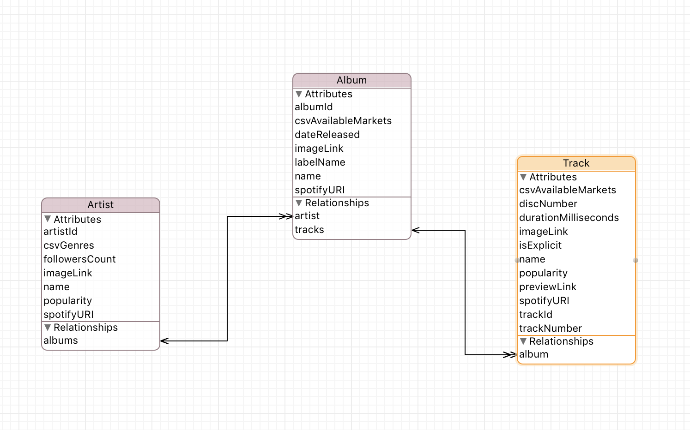
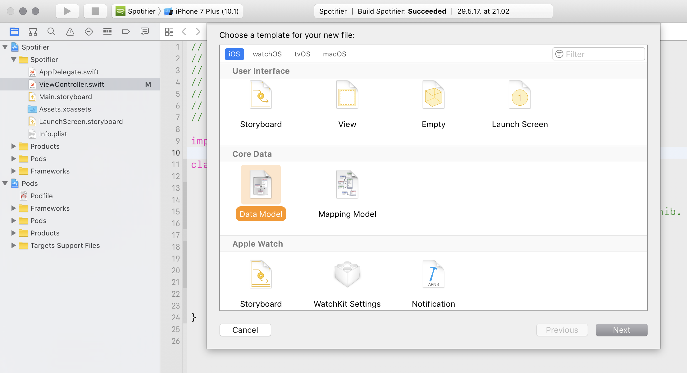
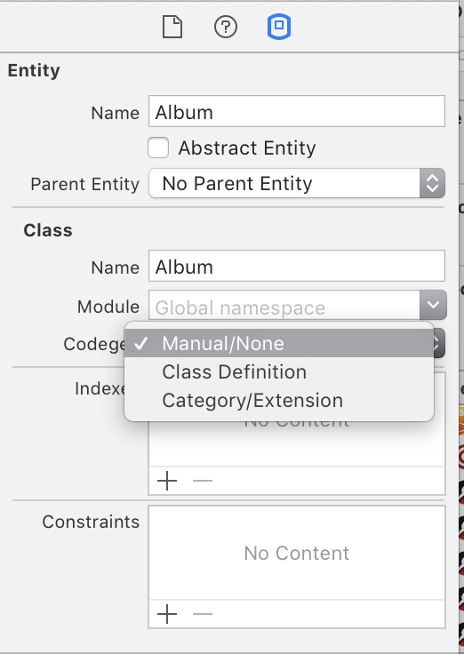
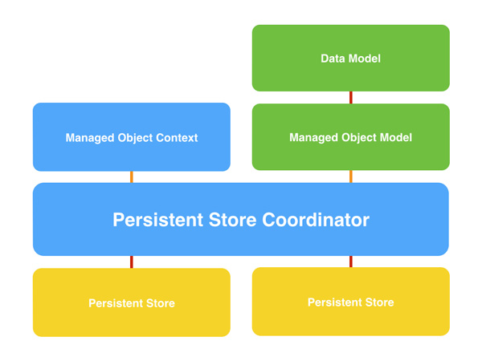

iOS Akademija

# Predavanja / 09


# iOS dev

Nova app: _Spotifier_. Kroz nju ćemo naučiti:

* JSON
* Collection Views and Collection View Layouts
* Notifications
* Core Data

Takođe utvrđujemo i proširujemo ranije stečeno znanje:

* kreiranje modela podataka
* pravilna raspodela posla unutar same app
* Singleton, Delegate i proširena MVC filozofija
* Rad sa više projekata kroz Xcode Workspaces


## Spotifier

Osnovne postavke:

* Koristićemo `Main.storyboard` za inicijalno startovanje same app
* Ne koristimo _segues_, već ćemo eventualno dodatno potrebne kontrolere “podizati” kroz kod, kao u Valute app
* Koristićemo Spotify Web API koji koristi JSON kao format za data transfer

Redosled posla, slična priča kao za Valute app:

1. Smisli šta želiš da uradiš i kako da app funkcioniše
2. Analiziraj izvor podataka (Spotify API)
3. Kreiraj data model u app tako da najpribližnije odgovara cilju same app *plus* da je izvorne podatke moguće transformisati u tu strukturu
4. Kreiraj app :)

Da bi znali šta je uopšte moguće da dobijemo od podataka, moramo prvo da analiziramo API. 

Ima više alata koji nam u tome mogu pomoći

* Sam Spotify ima mehanizam za testiranje: [API Console](https://developer.spotify.com/web-api/console/)
* Chrome plugin (extension): [Postman](https://www.getpostman.com)
* [Paw](https://paw.cloud), native Mac app

## Spotify API

* [Understanding the Spotify Web API](https://labs.spotify.com/2015/03/09/understanding-spotify-web-api/)

* [Web API Reference](https://developer.spotify.com/web-api/)

* [Endpoints reference](https://developer.spotify.com/web-api/endpoint-reference/)

* Primer JSON-a za [informacije o albumu](https://api.spotify.com/v1/albums/4aawyAB9vmqN3uQ7FjRGTy)

* Spotify razvija i [iOS SDK](https://developer.spotify.com/technologies/) za svoj servis ⚠️

---

## JSON 

[JSON](http://json.org) je danas najpopularniji data transfer format. Vrlo je kompaktan, jednostavan i trivijalan i za kreiranje i za parsiranje. _Total win!_

Ima brdo resursa za učenje: [what is json](https://duckduckgo.com/?q=what+is+json)

* [JSON in 3 minutes](http://www.secretgeek.net/json_3mins)
* [What is JSON, how it works and how to use it](https://www.copterlabs.com/json-what-it-is-how-it-works-how-to-use-it/)

> Odličan resurs za lepo formatiranje JSON teksta: [JSON Lint](http://jsonlint.com)

### JSON u Swiftu

`typealias JSON = [String: Any]`

To je to. Dictionary gde su ključevi uvek `String`, a vrednost može nominalno biti bilo šta, ali u praksi je to:

* `String`
* `Double`
* `Int`
* `Bool`
* `JSON`
* `[Any]`

Gde `Any` u `Array<Any>` takođe može biti samo jedno od ovih ostalih tipova.

### Working with JSON

Parsiranje JSON formata i konvertovanje u Swift objekte je tokom vremena postalo omiljena igračka Swift programera, pogotovo onih koji su učili _generics_ i još više onih koji su ljubitelji funkcionalnog programiranja.

To je uzelo toliko maha i podivljalo u meri da je i Apple Swift Core team morao da [“interveniše” na svom blogu](https://developer.apple.com/swift/blog/?id=37). 😌
Pročitajte taj blog post, nema ničega u njemu što već ne znate iz Swifta.

#### Marshal

Moj trenutni (_šic!_) favorit je [Marshal](https://github.com/utahiosmac/Marshal) library. Razlog što sam ga izabrao je [sledećih par pasusa](http://jasonlarsen.me/2015/06/23/no-magic-json.html) originalnog autora (Jason Larsen):

> However, most solutions tend to rely on a lot of magic: the magic of applicatives, functors, and monads; the magic of unfamiliar custom operators; the magic of a complex nested enum structure; the magic of multiple external dependencies.

> Now that Swift 2.0 has brought error handling to us, *we can implement much less magical JSON parsing*. Here is an example of what your JSON parsing code might look like with just a thin error-throwing layer over `[String: AnyObject]`.

*🎶 for my 👂🏻*

Ova biblioteka se interno duboko oslanja na Swift Generics ali je srećna okolnost što mi ne moramo da znamo generics da bi mogli da koristimo biblioteku.

---

E sad, kako da Marshal library uključimo u naš projekat?


## Xcode workspaces

Treći projekat koji radimo je najkompleksniji koji imamo i posao će biti kraći i (nadam se) lakši ako koristimo _3rd-party_ _open source_ _libraries_ / _frameworks_ koje su pisali drugi programeri (ne Apple).

Xcode podržava istovremeni rad sa više projekata kroz [Workspaces](https://developer.apple.com/library/ios/featuredarticles/XcodeConcepts/Concept-Workspace.html).

> Pogledajte i [Managing Xcode](http://pewpewthespells.com/blog/managing_xcode.html) by Samantha Marshall

Tokom godina iskristalisala su se dva široko prihvaćena koncepta za (koliko-toliko) automatizaciju korišćenja 3rd-party koda u iOS svetu:

- [CocoaPods](https://cocoapods.org)
- [Carthage](https://github.com/Carthage/Carthage)

Takođe se vrlo aktivno radi na Swift Package Manageru koji ima istu namenu - da se kod zapakuje kao eksterni modul i onda se jednostavno uključi u projekat kao eksterni _dependency_.

* [Package Manager](https://swift.org/package-manager/) on Swift.org
* An [Introduction to Swift Package Manager](https://www.raywenderlich.com/148832/introduction-swift-package-manager) on Ray Wenderlich

Mi ćemo koristiti CocoaPods.

### CocoaPods

1. [Instalirajte](https://guides.cocoapods.org/using/getting-started.html) kroz Terminal
2. Nakon što se završi, uradite `pod setup`

Način korišćenja za projekte:

1. Kreirajte projekat kao i obično
2. dodaje `.gitignore` i commit-ujte sav taj kod
3. Otvorite osnovni folder za projekat u terminalu. Izvršite `pod init`
4. To će kreirati `podfile` tekstualni fajl sa nekim osnovnim setupom
5. Sada otvorite taj fajl u bilo kom editoru i konfugurišete do mile volje. Minimalno: podesite platform deployment target i omogućite `use frameworks!`
6. Kada ste gotovi, nazad u terminal i kucate `pod install`. I čeeekaš…
7. Kada se završi, kreiraće `.xcworkspace` fajl - od tog momenta za rad **uvek** koristite workspace, a ne sam projekat direktno

Ende. Nema više. 

#### pod template

```
 use_frameworks!

 abstract_target 'MYApp' do
	platform :ios, '10.0'

	pod 'Marshal'

 # Targets
	target 'App'
 end
```


Sve van ovoga su razni sitni detalji i naprednije mogućnosti, koji vam ponekad zatrebaju a onda radite isto što i za bilo koju drugu tehnologiju - [čitate dokumentaciju](https://guides.cocoapods.org/using/index.html).

---

# Core Data

* [Core Data Programming Guide](https://developer.apple.com/library/ios/documentation/Cocoa/Conceptual/CoreData/)

Core Data nije baza podataka. Core Data je **objektni graf** (čiča Gliša struktura).



Bukvalno crtate objekte koji su vam potrebni, kreirate osobine koje definišu objekat i zatim ih povezujete u graf.

Time ste definisali *Data Model*.

### Kreiranje Data Modela

Prvo dodajemo odgovarajući fajl:



Za kreiranje grafa objekata, koristi se Core Data Modeler, koji se automatski prikaže kada u Project Navigatoru selektujete `.xcdatamodeld` fajl. 

Svaki objekat u grafu se modelira kao `Entity`. Svaki entitet ima:

- 1 ili više `Attributes` i 
- 0 ili više `Relationships`

## Swift reprezentacija modela

Da bi u kodu mogli da radimo sa entitetima, moramo kreirati njihov pandan u Swiftu. Za svaki od entiteta kreiramo odgovarajuću subklasu od `NSManagedObject`.

Ime subklase se deklariše putem _Data Model Inspector_ panela. Obično se koristi ime entiteta.



Xcode nudi 3 opcije za generisanje klasa. Preporuke:

- nikada ne koristite _Class definition_
- prihvatljiva opcija je _Category / Extension_
- najbolje: Manual opcija + `mogenerator` utility

### mogenerator

Koristićemo open-source utility koji se zove [MO Generator](https://github.com/rentzsch/mogenerator). Inicijalno je napisan za Objective-C ali je naknadno dodata mogućnost da generiše i Swift templates.

Ja koristim svoje custom MOgen templates za generisanje koda, jer su jednostavniji i Swift-olikiji od predefinisanih koje autori isporučuju.

(1) mogenerator se dodaje kao _New Target_ → _Cross-platform_ → _Aggregate_

(2) Zatim idete na _Build Phases_ tab, klik na `+` / _New Run Script Phase_

i tu stavite ovo:

```shell
cd DataModel

"${SRCROOT}/DataModel/tmpl/mogenerator" 
  --swift 
  --base-class ManagedObject
  --model Spotifier.xcdatamodeld 
  --template-path tmpl 
  --human-dir mogen-classes 
  --machine-dir mogen-properties
```

Ovo su bukvalno dve Terminal komande koje će biti izvršene kada uradite “Run” ovog targeta u Xcodeu. Svi parametri za mogenerator su opcioni, ali barem `—swift` je obavezan.

Sada je ostalo da generisane foldere dodate u projekat i to je to.

## Core Data Stack

Da bi u kodu mogli da radite sa ovim klasama i podacima koji stoje iza njih, potrebno je da se inicijalizuje *Core Data stack*.



* [Core Data Reference](https://developer.apple.com/reference/coredata)
	* [NSManagedObjectModel](https://developer.apple.com/reference/coredata/nsmanagedobjectmodel) je klasa koja instancira sam model
	* [NSPersistentStoreDescription](https://developer.apple.com/reference/coredata/nspersistentstoredescription) je klasa koja opisuje _store_, odnosno fajl na disku
	* [NSPersistentStore](https://developer.apple.com/reference/coredata/nspersistentstorecoordinator) je klasa koja modelira vrstu store-a. Ova klasa zapakuje u sebe sve detalje implementacije čitanja / pisanja za izabranu vrstu storea (SQlite, memory-only, XML, binary)
	* [NSPersistentStoreCoordinator](https://developer.apple.com/reference/coredata/nspersistentstorecoordinator) je klasa koja “priča” sa Store instancom iz prethodnog koraka. Ona je medijator između Contexta i Storea

### Process inicijalizacije Core Data stacka

1. Kreirajte URL gde će se fizički data file nalaziti. Dobro mesto je unutar `Library/Application Support` foldera
2. Instancirate `NSManagedObjectModel` na osnovu `.xcdatamodeld` fajla
3. Instancirate `NSPersistentStoreCoordinator`, koristeći MOM instancu iz prethodnog koraka
4. Kreirate instancu `NSPersistentStoreDescription` koristeći URL iz koraka 1
5. Dodate `NSPersistentStore` – koristeći opis iz prethodnog koraka – na PSC (iz koraka 3)
6. Sada konačno imate stack spreman i možete kreirati main `ManagedObjectContext`

_Pheeew…_ 😅

*Savet:* Izbegavajte da štiklirate `Use Core Data` kada kreirate Xcode project template. Ili barem taj kod odatle izvucite negde drugde.
Core Data stack nema šta da traži u AppDelegate fajlu. Ako ništa drugo, stack treba izvući u poseban fajl / klasu i koristiti kao singleton ili kao property AppDelegate.

> Koristićemo [RTCoreDataStack](https://github.com/radianttap/RTSwiftCoreDataStack) by 😎, kroz CocoaPods.

Počev od iOS-a 10, Apple je u Core Data framework dodao [NSPersistentContainer](https://developer.apple.com/reference/coredata/nspersistentcontainer) klasu koja radi deo mogućnosti koje RTCoreDataStack već ima.


### Korišćenje u aplikaciji

Ok, sada sledi serija klasa iz Core Data frameworka od interesa za rad sa objektima u samoj iOS aplikaciji:

* [NSEntityDescription](https://developer.apple.com/reference/coredata/nsentitydescription) je klasa koja opisuje entitet (objekat) u Core Data
* [NSManagedObject](https://developer.apple.com/reference/coredata/nsmanagedobject) - osnovna (_base_) klasa za sve vaše objekte / entitete. Za kreiranje instance neophodno je da imamo instancu opisa iz prethodnog koraka (property `entity`)
* [NSManagedObjectID](https://developer.apple.com/reference/coredata/nsmanagedobjectid) je jedinstveni ID za svaku instancu koju snimite u Core Data. Ovo je tip `objectID` propertyja svakog NSManagedObject-a
* [NSManagedObjectContext](https://developer.apple.com/reference/coredata/nsmanagedobjectcontext) je klasa koja “drži” sve konkretne objekte (instance NSMO) sa kojima radite u aplikaciji. “Vezana” je ili direktno za NSPSC ili za neki drugi (parent) Context. NSMO instanca se kreira / čita isključivo putem MOC instance.

_Pheeew, pheeew…_ 😓 
<small>(ima još)</small>

Da pročitamo podatke iz Core Data, moramo da instanciramo [NSFetchRequest](https://developer.apple.com/reference/coredata/nsfetchrequest), da mu opciono zadamo uslov i da obavezno zadamo barem jedan parametar za sortiranje.

Rezultat ovog _fetch_ jeste niz objekata traženog entiteta koji zadovoljavaju dati uslov.

Posebno za rad sa tabelarnim prikazom, koriste se specijalna klasa [NSFetchedResultsController](https://developer.apple.com/reference/coredata/nsfetchedresultscontroller) i njen delegate pattern [NSFetchedResultsControllerDelegate](https://developer.apple.com/reference/coredata/nsfetchedresultscontrollerdelegate).
