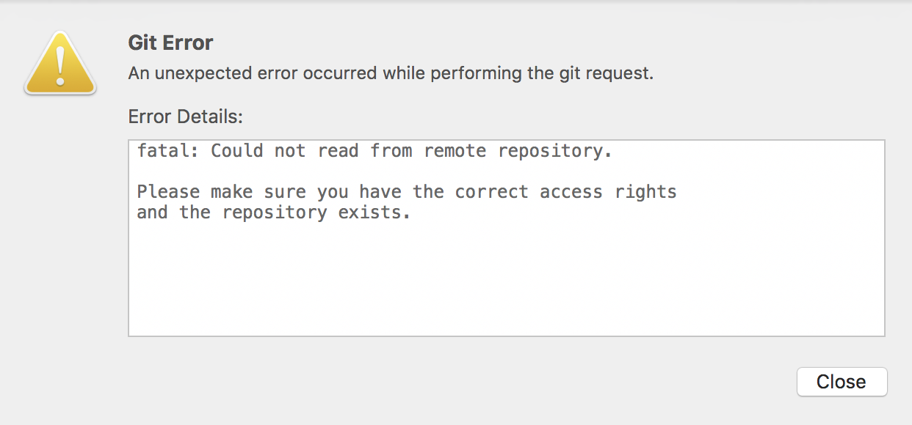
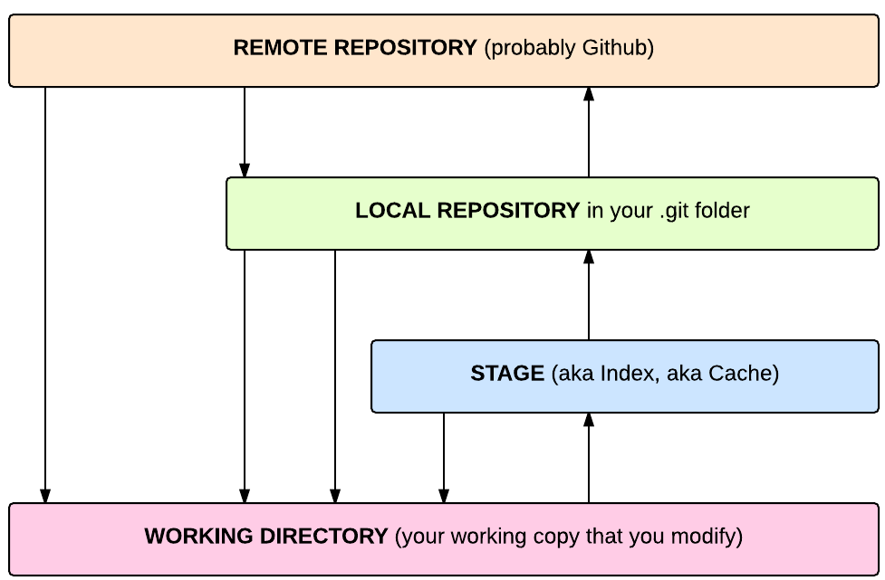
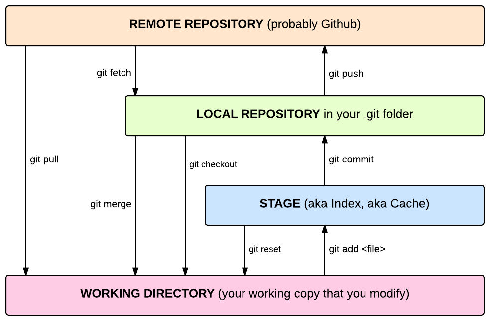

# git

git je Distributed Version Control System

git je command-line tool i dobijate ga već instaliranog na Macu.
Gde se nalazi na Macu i koju verziju imate možete videti na ovaj način:

```
$ which git
/usr/local/bin/git
$ git --version
git version 2.3.0
```

## SSL Troubleshooting:

Ako dobijete grešku prilikom bilo koje od remote operacija, tipa  fetch, pull ili push, koja je nešto ovako (u Forku):



To obično znači da SSL key nije učitan u memoriju. To proverate ovako:

```
$ ssh-add -l
No identities
```

Ovako ga učitate i onda će raditi:

```
$ ssh-add ~/.ssh/id_rsa
```


## Kako naučiti

* [Zvanična knjiga](https://git-scm.com/book/en/v2)
* [Basics](https://git-scm.com/book/en/v2/Getting-Started-Git-Basics)

* [GitHub / Code School](https://try.github.io/)
* [No deep shit](http://rogerdudler.github.io/git-guide/) guide
* Learn [git branching](http://learngitbranching.js.org)

* Atlassian’s [git guide](https://www.atlassian.com/git/) (mada je šuma puna drveća…)


## Osnovni pojmovi

- osnovni pojam je *repository*, skladište koda
- nema centralne tačke koja je primarna istina, može biti neograničen broj repo-a
- svaki repo na vašem računaru je samo vaš i izmena u bilo kom drugom repou ne utiče na njega
- svaki repo može da se kombinuje i sinhronizuje sa bilo kojim drugim
- Postoje javni serveri za kreiranje repoa, gde možete imati public / private repo: [BitBucket](https://bitbucket.org), [Github](https://github.com), [GitLab](https://gitlab.com) itd

### Pojmovi



- `repository`
= to je skladište koda; u praksi je to folder na vašem ličnom ili nekom drugom računaru
Kod git-a, to je skriveni folder imenovan `.git`

- `working copy`
= trenutno aktivna kopija koda na vašem računaru. To su fajlovi koje vidite na svom računaru, to je ono što menjate. Može sadržati i fajlove koji ne idu u git repo

- `stage`
= Set markiranih fajlova iz working copy koji će biti deo git repo updatea, tj. nad kojima će neka naredna git operacija biti izvršena

- `branches`	
= jedna ili više grana koda unutar git repo-a
Uobičajena imena su `master`, `develop`, `featureYY`, `hotfixXX` ali može biti bilo šta: `b1`, `test`, `trtemrte`, `samodaprobam` itd.

- `remotes`
= bilo koji drugi repo, što na vašem računaru, što na nekom drugom u lokalnoj mreži ili na internetu
Uobičajena imena su `origin`, `upstream` ali može biti bilo šta (`trtemrte`, `mypreciouuuuus`)

### Osnovne operacije



- `init`
= kreiranje praznog lokalnog git repoa u nekom folderu. Rezultat ovoga je da u tom folderu sada imate skriveni `.git` podfolder - **nikada** ručno ne prčkajte ništa po tom podfolderu

- `commit`	
= snimanje izmena iz working copy foldera u aktivni git branch u lokalnom repou. Mora biti propraćen opisnom porukom

- `clone`
= Kreiranje novog repoa tako što automatski dohvatate sadržaj nekog drugog postojećeg repoa

- `fetch`
= dohvatanje loga izmena + samih izmena sa nekog drugog repoa i kreiranje lokalne ispostave tog repoa unutar .git foldera

- `pull`
= dohvatanje konkretnih izmena koda sa nekog drugog repoa i automatski merge u granu koja je trenutno checkout-ovana u working copy folderu

- `push`
= slanje izmena iz lokalnog repoa u neki drugi repo

- `branch`
= kreiranje nove, nezavisne grane koda u tekućem repou

- `checkout`
= izbor grane (branch) koju želite da menjate
Rezultat operacije je da se sav kod iz te grane unutar git repoa kopira u working copy, tj. u vidljivi folder na računaru

- `merge`
= to što mu ime kaže - sjedinjuje izmene na istom fajlu/fajlovima između neke neaktivne grane i working copy verzije

- `conflict`
= glavobolja. Ako se prilikom merge-a desi da u istoj liniji koda i istoj koloni postoje izmene i u lokalu i na udaljenoj grani, onda git ne zna koju izmenu da snimi kao finalni i to morate ručno da izabete

	
## Preporuke za dnevni rad

- male promene vezane za jednu celinu, jedan feature ili jedan bug, == jedan commit
- mnogo malih commitova = malo ili nimalo merge glavobolja
- commit message treba da opiše *šta je razlog / svrha promene* koja se snima u git, ne opis šta je izmenjeno
- kopija na barem jedan remote, bilo gde što nije tvoj računar (Github, Bitbucket, GitLab, gde god)

### .gitignore_global

Da bi videli ove hidden fajlove – svi fajlvovi koji počinju tačkom su hidden - koristite `⌘⇧.` shortcut u Finderu.

Napravite novi fajl i u njega ubacite ovaj sadržaj:

```
*~
*.orig
*.rej
*.swp
*.obj
*.o
*.ncb
*.ilk
*.exe
*.dll
*.lib
*.manifest
*.pdb
*.idb
*.rsp
*.dep
*.so
.DS_Store
*.xccheckout
```

Ovo snimiti u Home folder, kao fajl `.gitignore_global`.

Ovo je komanda kojom se git-u kaže da ovaj fajl koristi kao globalni gitignore:

```shell
git config --global core.excludesfile '~/.gitignore_global'
```

### gitignore

Ne zaboravite da dodate `.gitignore` fajl za svaki novi Xcode projekat. Već ga imate u _predavanja_ git repou, pa ga odatle možete iskopirati kojekude:

```
$ cd ~/iosakademija/projekti/Calculator/
$ cp ~/iosakademija/predavanja/.gitignore .
```

* .gitignore [na tri načina](http://365git.tumblr.com/post/519016351/three-ways-of-excluding-files)

* Na [Githubu](https://github.com/github/gitignore) imate sadržaj .gitignore fajla za razne namene i programske jezike
* Direktan [link na Swift verziju](https://github.com/github/gitignore/blob/master/Swift.gitignore) da lakše pokupite  (koristite Raw prikaz za kopiranje)

## Vizuelni alati

Mac GUI klijenti:

* [Source Tree](https://www.sourcetreeapp.com)
* [Tower](https://www.git-tower.com)
* [GitBox](http://gitboxapp.com)
* [Fork](https://git-fork.com)
* Xcode

iOS apps:

* [Working Copy](http://workingcopyapp.com/)
* [Git2Go](http://git2go.com)
* [Trident](http://somerobots.com)
* [Branches](http://branchesapp.co)

Merge alati:

* [Kaleidoscope](http://www.kaleidoscopeapp.com)
* [Beyond Compare](http://www.scootersoftware.com)
* [Changes](http://martiancraft.com/products/changes.html)

## Naprednije stvari

* [Stash, patch and Git Flow](https://cocoacasts.com/three-git-tricks-every-developer-should-know/)
* [git-flow](http://nvie.com/posts/a-successful-git-branching-model/)
* git-flow [cheatsheet](http://danielkummer.github.io/git-flow-cheatsheet/)

## Korisni linkovi

* [Xcode 8 i git](https://www.raywenderlich.com/153084/use-git-source-control-xcode-8)
* [Oh shit git](http://ohshitgit.com/)