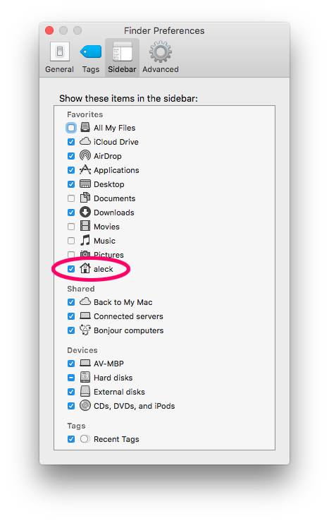

iOS Akademija
# Mac 101

Korisni sajtovi za učenje nekih osnovnih stvari u Macu:

* [New to Mac](https://support.apple.com/explore/new-to-mac)
* [Mac Support](https://support.apple.com/en-in/mac)
* [macOS Support](https://support.apple.com/en-in/macos)

Preporuka: napravite nekoliko foldera u Safari Favorites baru pa u njega stavljajte korisne linkove. Mac, git, Xcode, iOSdev

## Tips

* Finder → Preferences → Sidebar
= uključite prikaz Home foldera

*  → System Preferences → Trackpad
= Settings + help za korišćenje trackpada

*  → System Preferences → Keyboard
	- Keyboard - Use F1, F2…
	- Shortcuts - 'All controls' na dnu 
	- Input Sources - aktivne tastature i način kako da ih menjate

## Shortcuts

[macOS keyboard shortcuts](https://support.apple.com/en-in/ht201236) uglavnom se zasnivaju na kombinaciji ovih tastera:

* Command: `⌘`
* Shift `⇧`
* Option (Alt) `⌥`
* Control `⌃`
* Caps Lock `⇪`

Neke zanimljivije…

* `⌘ ,`	= Preferences
* `⌃ ⌘ Space`	= Character viewer
* `⌃ Space`	= Promena aktivne tastature (jezika)
* `⌘ Space`	= Spotlight (otvaranje aplikacija, pretraživanje Maca)
* `⌘ Tab`	= pandan Alt+Tab u Windowsu, brzi prelaz u neku drugu app

## Korisni 3rd-party programi

* [Caffeine](http://lightheadsw.com/caffeine/)
* [Default Folder X](http://www.stclairsoft.com/DefaultFolderX/)

